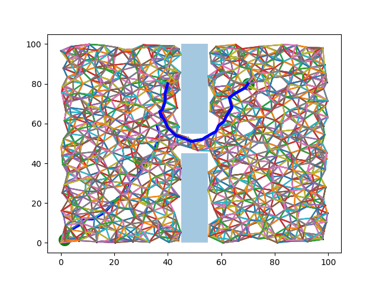

# PRM-Path-Planning
Probabilistic Roadmaps is a path planning algorithm used in Robotics.

## How to run
```
pip install -r requirement.txt
python main.py
```

You can also specify number of samples:
```
python main.py --numSamples [number]
```

## Steps of algorithm
1. Generate n random samples called milestones.
2. Check if milestones are collision free.
3. Find k valid neighbours/paths:
   - Link each milestone to k nearest neighbours.
   - Retain collision free links as local paths.
4. Search for shortest path from start to end node using an algoruthm. In this case we are using Dijksta's shortest path algorithm.

## PRM vs RRT (Randomly Expanding Trees)
PRM was choosen since it is probabilistically complete and in a small map like the one given in this problem, sampling is time efficient.

## Example Path
### PRM with 1000 samples


## Problem
"You are given as input the current and target coordinates of a robot, as well as the top left and bottom right points of rectangular obstacles."

## How to Specify Obstacles - Use environment.txt
```starting point;target point
list of obstacle coordinates
-1
```
Example:
```
10,10;80,30
20,10;20,50
20,50;90,50
30,30;40,40
-1
```